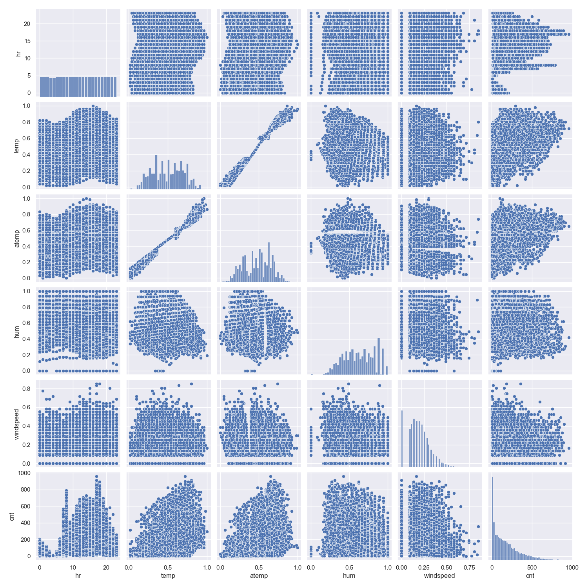
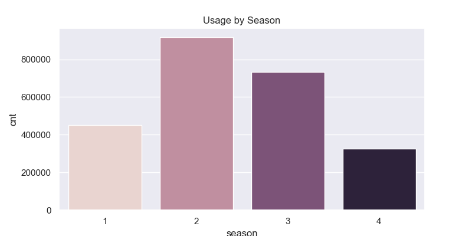
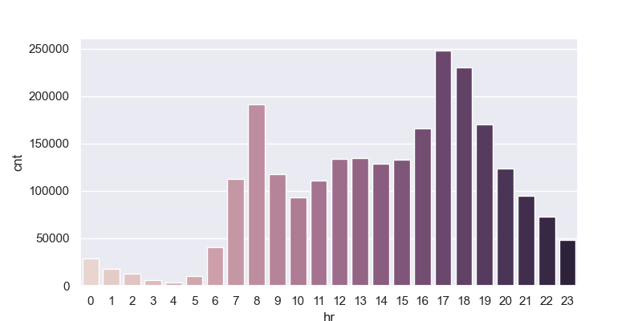
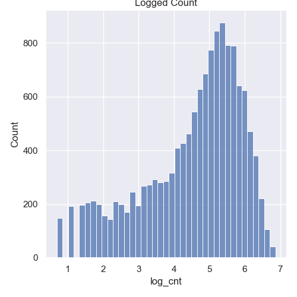

# Bike Prediction

## Introduction

Bicycles play a key role in urban mobility and are essential for building sustainable, green cities. In recent years, bike-sharing services have seen a steady increase in demand. Accurately forecasting this demand is critical to ensure a well-balanced and efficient service.

In this project, I explore historical usage and weather data, perform data analysis, and apply machine learning models to predict hourly bike demand.

## Data
This dataset has been given in a challenge and some of the variables come already normalized, i.e. hum. 

- **dteday:** Date
- **season:** Season of the year (1 = spring, 2=summer, 3 = fall, 3 = winter)
- **yr:** Year
- **mnth:** Month
- **hr:** Hour
- **holiday:** Binary variable indicating whether was holiday or not.
- **weekday:** Day of the week expressed as number, thus ordinal type.
- **workingday:** Whether it is a working day or not.
- **weathersit:** Weather situation
- **temp:** Temperature in Celcious
- **atemp:** Temperature sensation ("Feels like")
- **hum:** Humidity
- **windspeed:** Wind Speed
- **cnt:** Number of bikes used. Target Variable

## Exploratory Data Analysis (EDA)

**Notes:**
- Temp, atemp and hum seem to follow a normal distribution.
- cnt, and windspeed show skewed distribution. 
- Almost perfect correlation between atemp and temp.
- As observable in the scatterplot when the temp and atemp increase, on average, the demand also increases.

 

**Notes:**
- Atemp relates to the feeling temperature, hence this strong correlation between these two.
- Month and season also notorious correlation
- hr and temp seems to be the variables that affect the most to bike demand. 

### Temp Analysis

**Notes:**
- Bike demand shows an increasing pattern from march to july approximately.

**Notes:**
- Spring and summer are the seasons with more demand
- There seems to be some degree of seasonality in the demand for bikes.

**Notes:**
- The data does not show any relevant pattern for weekdays.

**Notes:**
- Demand seems to be higher during rush hours. People may use the service for commuting to work or school and later for going home or other places.

**Notes:**
- During week days, the demand increases during rush hours, specially when peaople commute to work/school and when they commute back home or any other place.
- On the other hand, during weekends, the demand increases during noon, where people may use it for leisure.

**Notes:**
- Target variable shows a right skewed distribution. 
- This distribution indicates lots of low demands with some eventful spikes.
- Applying a log transformation to the target variable should improve the results on ML algorithms such as Linear Regression, or Random Forests. 

**Notes:**
- Now the target variable looks more suitable for applying ML algos.

## Results
The purpose of this project is to forecast the demand for bikes based on some historical and weather data. Because the nature of the problem, I have applied the following basic algorithms which are suitable for this kind of problems:
- Linear Regression
- Lasso
- Ridge
- Decision Tree
- Random Forest
- XGBoost

## Conclusions